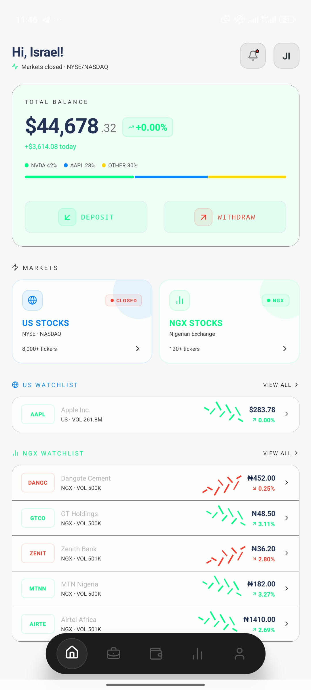
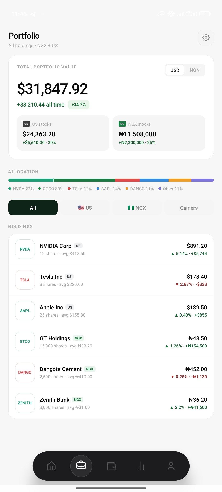
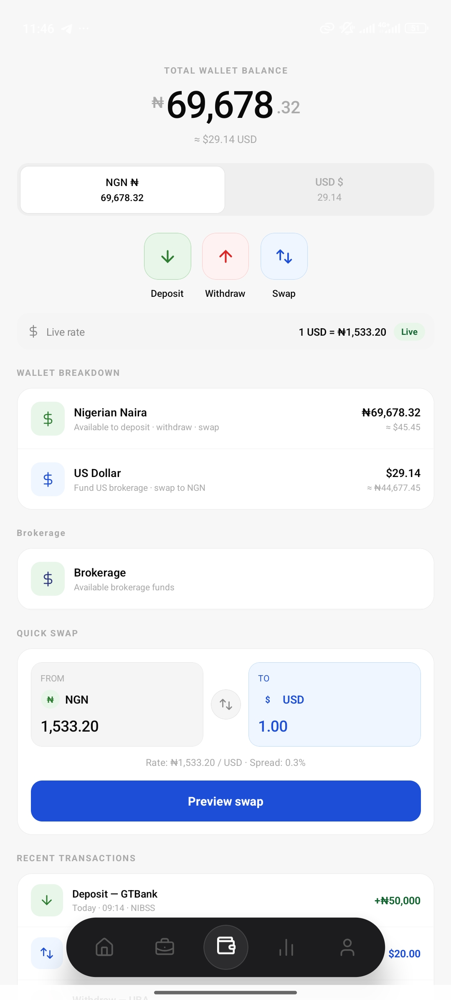
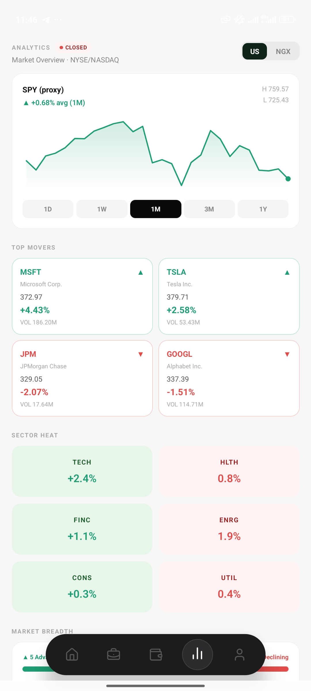
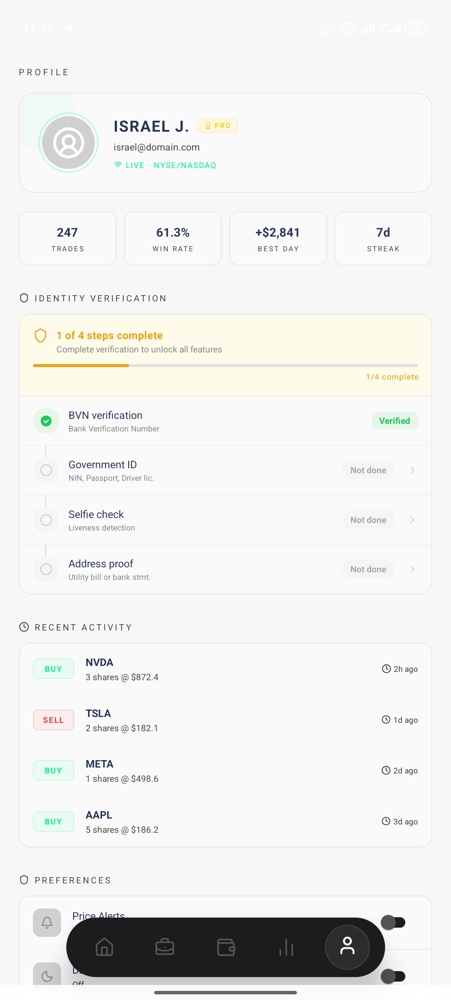

# Marked

A production-grade stock trading and fintech mobile application built with React Native and Expo. Trade US (NYSE/NASDAQ) and Nigerian (NGX) stocks, manage a multi-currency wallet, and handle deposits/withdrawals — all from one app.

<p align="center">
  
  
  
  
  
</p>

---

## Features

### Markets & Trading
- **Dual-exchange support** — browse 8,000+ US tickers (NYSE/NASDAQ) and 120+ NGX tickers
- **Real-time quotes** — live prices, volume, change %, and sparkline charts
- **Stock detail** — candlestick charts (1D/1W/1M/3M/1Y), company info, news feed, related companies
- **Buy & Sell** — place orders with instant confirmation
- **Watchlists** — separate US and NGX watchlists on the home screen

### Portfolio
- **Total portfolio value** — USD and NGN views with all-time P&L
- **Allocation breakdown** — visual bar chart of holdings by ticker
- **Holdings list** — filter by All / US / NGX / Gainers with per-position cost basis and return

### Wallet
- **Multi-currency balances** — NGN and USD with live FX rate
- **Deposit** — bank account (NIBSS), debit card (Visa/MC/Verve/Amex), USSD, or bank transfer to virtual account
- **Withdraw** — select bank, NIBSS account name verification with fuzzy matching
- **Quick Swap** — NGN to USD conversion with live spread
- **Brokerage funding** — fund and withdraw from brokerage sub-account
- **Transaction history** — deposits, withdrawals, and swaps

### Analytics
- **Market overview** — SPY proxy chart with period selectors
- **Top movers** — biggest gainers and losers
- **Sector heatmap** — Tech, Health, Finance, Energy, Consumer, Utilities
- **Market breadth** — advancing vs declining tickers

### Profile & Security
- **KYC verification** — 4-step flow: BVN, Government ID, Selfie, Address proof
- **Biometric auth** — fingerprint/face unlock for sensitive actions
- **Trade stats** — total trades, win rate, best day, streak
- **Recent activity feed** — buy/sell history with timestamps

---

## Architecture

```
src/
├── app/                          # Expo Router file-based routing
│   ├── (auth)/                   # Auth screens (login, sign-up, forgot-password, KYC)
│   └── (protected)/              # Authenticated screens
│       ├── (tabs)/               # Bottom tab navigator
│       │   ├── index.tsx         #   Home — balance, markets, watchlists
│       │   ├── portfolio.tsx     #   Portfolio — holdings, allocation
│       │   ├── wallet.tsx        #   Wallet — balances, swap, transactions
│       │   ├── analytics.tsx     #   Analytics — charts, movers, sectors
│       │   └── profile.tsx       #   Profile — KYC, settings, logout
│       ├── payment/
│       │   ├── deposit/          #   Deposit flow (amount → method → confirm → success)
│       │   └── withdraw/         #   Withdraw flow (amount → bank select → confirm)
│       ├── brokerage/            #   Fund/withdraw brokerage account
│       ├── swap/                 #   Currency swap flow
│       └── market.tsx            #   Stock detail screen
├── store/
│   ├── store.ts                  # Redux Toolkit store (auth)
│   ├── slices/authSlice.ts       # Auth state (user, token)
│   ├── useBankAccountStore.ts    # Zustand + AsyncStorage — saved bank accounts
│   ├── useCardStore.ts           # Zustand + AsyncStorage — saved debit cards
│   └── useWalletStore.ts         # Zustand + AsyncStorage — wallet balances
├── theme/
│   ├── color.ts                  # Color palette
│   ├── useColor.ts               # Theme-aware color hook
│   └── useThemeStore.ts          # Zustand + AsyncStorage — dark/light mode
├── hooks/
│   ├── useAuth.ts                # Auth guard hook
│   ├── useAppDispatch.ts         # Typed Redux dispatch
│   ├── useAppSelector.ts         # Typed Redux selector
│   └── useBiometricAuth.tsx      # Expo LocalAuthentication wrapper
├── lib/
│   ├── storage.ts                # Expo SecureStore wrapper
│   ├── mmkv.ts                   # MMKV storage instance
│   └── fetchWithTimeout.ts       # Fetch with timeout utility
└── config/
    └── env.ts                    # Environment configuration
```

### State Management

| Concern | Solution | Persistence |
|---------|----------|-------------|
| Auth (user, token) | Redux Toolkit | Expo SecureStore |
| Wallet balances | Zustand | AsyncStorage |
| Saved bank accounts | Zustand | AsyncStorage |
| Saved debit cards | Zustand | AsyncStorage |
| Theme preference | Zustand | AsyncStorage |

All Zustand stores reset to seed state on logout — AsyncStorage keys are removed and in-memory state is replaced with defaults.

---

## Tech Stack

| Layer | Technology |
|-------|-----------|
| Framework | [Expo SDK 56](https://docs.expo.dev/versions/v56.0.0/) + React Native 0.85 |
| Navigation | Expo Router (file-based, typed routes) |
| State | Redux Toolkit (auth) + Zustand (persisted local state) |
| Storage | AsyncStorage, Expo SecureStore, MMKV |
| UI | React Native core + Lucide icons + react-native-svg |
| Auth | Expo LocalAuthentication (biometrics) |
| Animations | React Native Animated API |
| Language | TypeScript 6.0 |

---

## Getting Started

### Prerequisites

- Node.js >= 18
- npm or yarn
- [Expo CLI](https://docs.expo.dev/get-started/installation/)
- Android Studio (for Android emulator) or Xcode (for iOS simulator)

### Installation

```bash
# Clone the repository
git clone https://github.com/lordisrael/Marked.git
cd Marked

# Install dependencies
npm install
```

### Running the App

```bash
# Start the Expo development server
npx expo start

# Run on Android
npx expo start --android

# Run on iOS
npx expo start --ios
```

### EAS Build (Production)

```bash
# Install EAS CLI
npm install -g eas-cli

# Build for Android
eas build --platform android

# Build for iOS
eas build --platform ios
```

---

## Project Configuration

| File | Purpose |
|------|---------|
| `app.json` | Expo config — app name, icons, splash, plugins |
| `eas.json` | EAS Build profiles |
| `tsconfig.json` | TypeScript configuration |
| `src/config/env.ts` | API URLs and environment variables |

---

## License

This project is proprietary. All rights reserved.
